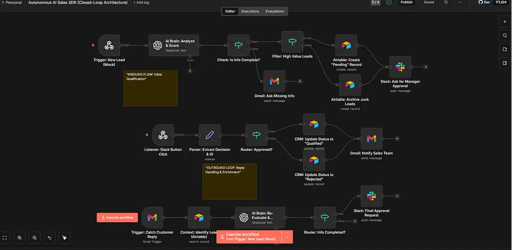

# 🤝 Autonomous AI Sales SDR (Closed-Loop Architecture)

> **"A Sales Agent that doesn't just filter leads—it talks to them." A closed-loop system that asks missing questions, listens for replies, and updates CRM context autonomously.**

## 🚨 The Problem
In B2B sales, the biggest time-waster isn't "unqualified leads," but **"incomplete leads."**
* Sales Reps spend days asking basic questions: "What is your budget?" or "When do you plan to start?"
* Manual Follow-up: Tracking who replied to what email and updating the CRM manually is prone to error.
* **The Gap:** Standard automations are "fire-and-forget." They can't handle a conversation if the customer replies 3 days later.

## ✅ The Solution (V4.0 Architecture)
This system acts as a fully autonomous **SDR (Sales Development Representative)** with a **Closed-Loop Architecture**.
1.  **It Analyzes:** Reads the incoming lead and checks for BANT criteria (Budget, Authority, Need, Timeline).
2.  **It Asks:** If information (e.g., Budget) is missing, it **autonomously** emails the lead to ask for it—without bothering the human team.
3.  **It Listens:** It monitors the inbox for replies. When the lead responds (even days later), the AI matches the reply to the original lead in **Airtable**.
4.  **It Qualifies:** Only when the profile is complete does it notify the human manager via **Slack** for final approval.

## 🛠 Tech Stack & Architecture

| Technology | Role |
|------------|------|
| **n8n** | Branching logic, state management, and process orchestration. |
| **OpenAI (GPT-4o)** | Semantic analysis (BANT check), intent detection, and natural language generation. |
| **Gmail API** | Two-way communication (Sending inquiries & Listening for replies). |
| **Airtable** | Relational Database & Context Storage (Memory). |
| **Slack Block Kit** | Human-in-the-loop approval interface. |

## ⚙️ Workflow Logic (The Closed-Loop)

### 1. Inbound Flow (Active Inquiry)
* **Capture:** Web form data arrives.
* **AI Brain:** GPT-4o scans for BANT.
* **Decision:**
    * *Complete Lead:* Send to Approval.
    * *Incomplete Lead:* Route to "False" path -> AI generates a specific question -> Email sent.

### 2. Outbound Loop (Context Awareness)
* **Reply Listener:** The system watches for incoming emails 24/7.
* **Context Match:** It searches Airtable to find *which* lead this reply belongs to.
* **Re-Evaluation:** AI merges the new answer (e.g., "$10k Budget") with the old data and updates the score.

### 3. Human-in-the-Loop
* Once the lead is fully qualified, a **Slack Card** is generated.
* The manager clicks "Approve," and the lead is officially handed over to the Sales Team.

## 🚀 How to Use

1.  Import the `workflow.json` file into n8n.
2.  Set up your **Airtable Base** (Columns: Name, Email, Status, BANT_Score, Missing_Info).
3.  Connect **Gmail API** (Scope: Read/Write/Send).
4.  Configure **Slack Webhook** for notifications.
5.  Watch your AI SDR qualify leads while you sleep!

📞 İletişim & Destek
Bu proje veya benzer n8n otomasyonları hakkında danışmanlık almak isterseniz: 
👉 Web Sitemi Ziyaret Edin: emrahdemirkoc.com  📧 E-posta: emrahdemirkoc@gmail.com
---

### 👤 Author
**Emrah Digital** - *Building the Agentic Workforce*
[Visit my Website](https://emrahdemirkoc.com)
